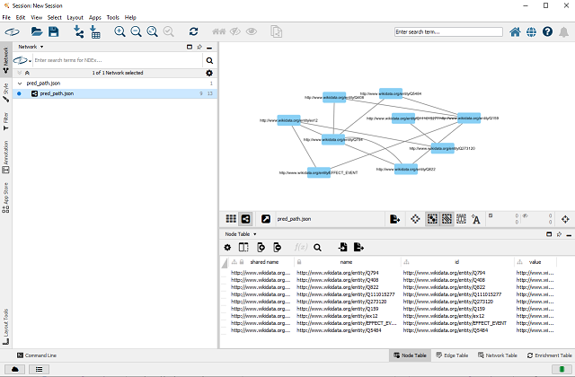
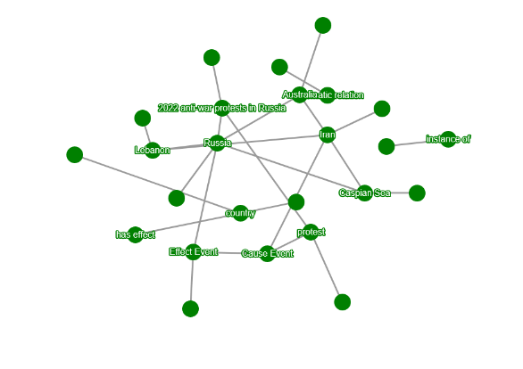
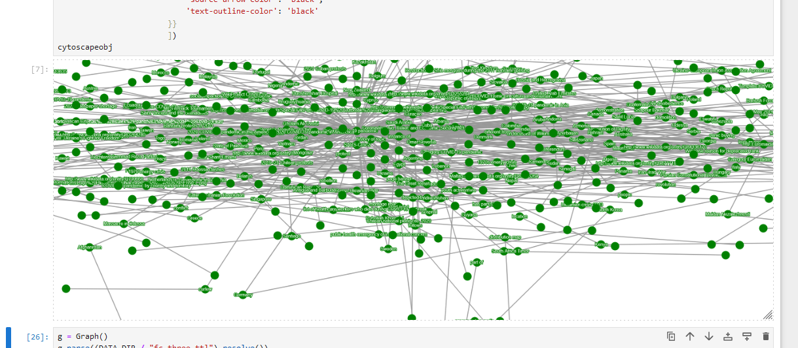

# Cytoscape

Links: 
- Cytoscape: https://cytoscape.org/index.html
- ipycytoscape: https://github.com/cytoscape/ipycytoscape

## Overview

Cytoscape is a network visualization platform, apparently mostly intended for the bioinformatics domain.
It has many nice visualization features, demos, and apps/plugins.

Cytoscape has a desktop application as well as an associated javascript library. It also has a jupyter plugin,
which we'll be using in this demo.

For both loading data into Cytoscape as well as using ipycytoscape,
we'll have to convert from RDF graphs to a more common format like [networkx](https://networkx.org/) MultiDiGraphs or make our
own custom parser to convert it into an appropriate json format.

## Instructions

This demo will assume the use of networkx and ipycytoscape in a jupyter notebook.
`pip install networkx`
`pip install ipycytoscape`

One option is to convert your RDF data into networkx, which has its own method to convert into a format suitable
to load into Cytoscape. An example of how you can convert to networkx is shown in `rdf_to_cytoscape.ipynb`.
You can download the [Cytoscape desktop app](https://cytoscape.org/download.html) and load the json using the
`import network from file system` option.

If you instead choose to use the jupyter plugin (shown in the same notebook as above), after converting your RDF
graph into either networkx or a custom json, you can do some visualizations.

I'm not familiar enough with all the layout options to make it look very nice at this point, but it *is* nice that
the ipycytoscape plugin can let you drag and drop. 

This starts to get a little hard to follow for larger graphs though.

### Pros

- Easy to use as a "demo" in a notebook
- Relatively powerful
- Somewhat interactive

### Cons

- Some effort required for customization and conversion to appropriate graph format
- The jupyter plugin's display isn't too great
