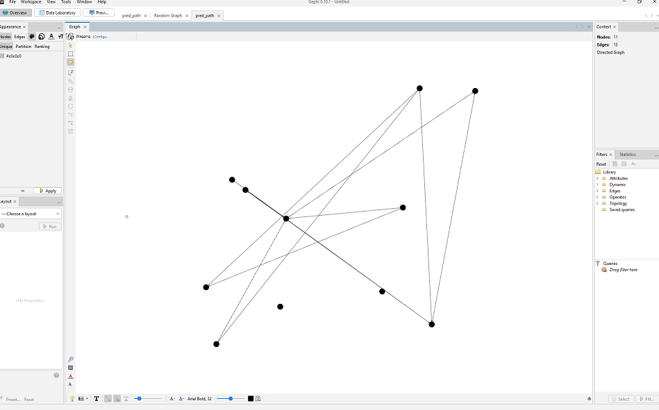
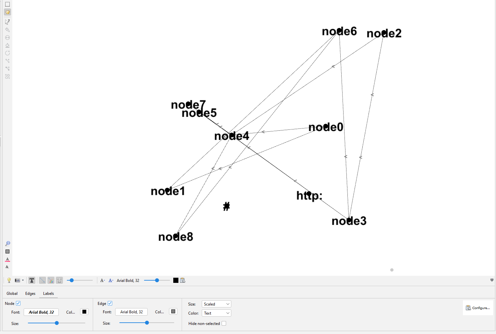
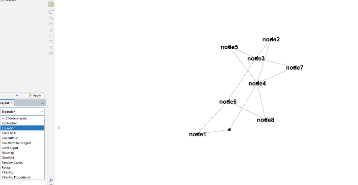

# Gephi

Link: https://gephi.org/

## Overview

Gephi is another open source graph visualization/exploration software. The focus of Gephi appears to be to make graph
exploration easy, with built in metrics and tools for analysis and suggesting it can be used with
"no programming skills needed".

Gephi supports many common file formats, but not RDF, so we'll have to once again put some effort into converting
into formats such as graphml or DOT. For the sake of this demo, we'll reuse the DOT conversion from our
[graphviz](../graphviz) example.

## Instructions

[Download and install](https://gephi.org/users/download/) gephi. Downloads are available for Windows, Mac, and Linux.

Convert your RDF into DOT, or any other format that is
[supported by gephi](https://gephi.org/users/supported-graph-formats/).
For the sake of this demo, we'll be re-using the DOT conversion script that we used for graphviz.

Due to [an apparent bug](https://github.com/gephi/gephi/issues/2864) related to importing DOT, you also need to remove
statements in the DOT output about the graph and node specs... two examples that can be correctly opened are included
in this directory.

After installing Gephi and appropriately converting them, you can simply `Open` your DOT files.

You can also turn on labels... but it looks like the basic conversion to DOT that worked with Graphiviz doesn't 
properly convert the labels into a format that can be nicely imported by Gephi.  

As with many other tools, you also have a few options to automatically apply various layouts.

### Pros

- Some network analysis tools seem useful

### Cons

- UI feels somewhat clunky
- Importing RDF seems to require extra steps; the software overall feels like it's intended for a very different kind of
network data