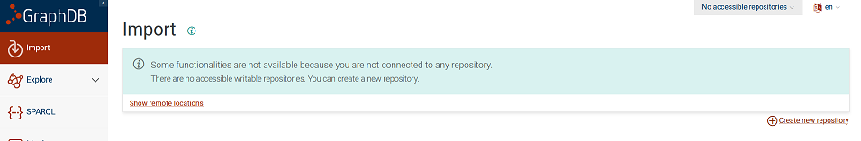
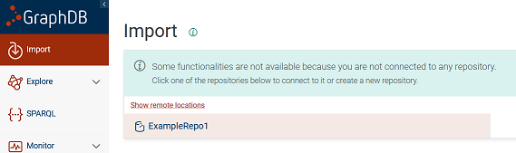
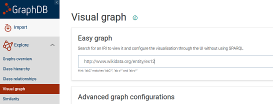
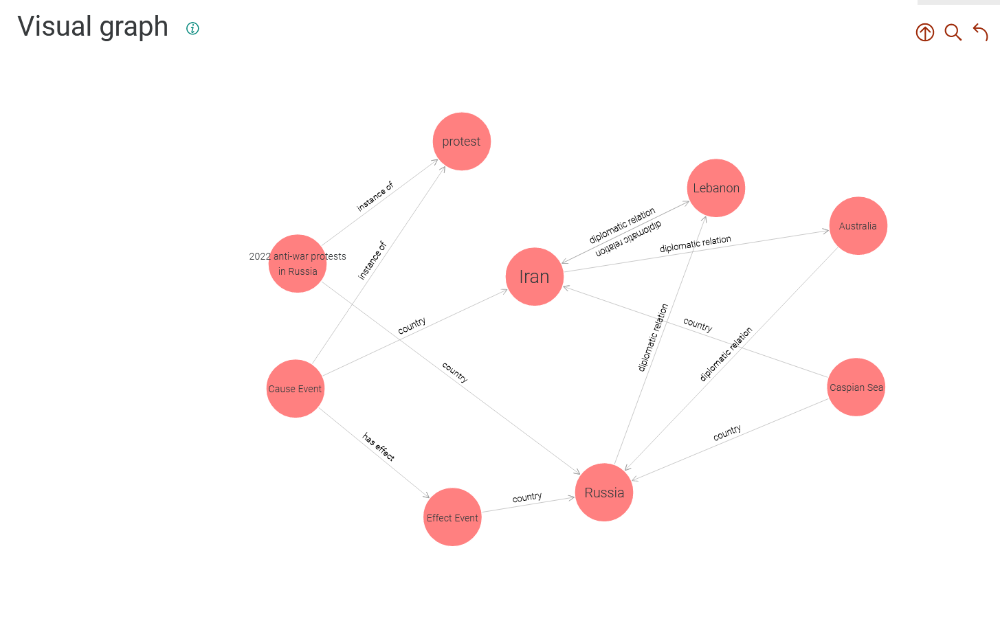

# GraphDB

Link: https://graphdb.ontotext.com/

## Overview

GraphDB is a general purpose database for RDF-style graphs, developed by Ontotext. Ontotext is very familiar with
W3C standards, Linked Data, and other semantic web related topics, so the tool is a good fit for use cases involving
RDF triples. 

## Instructions

GraphDB offers an enterprise and free version of their software -- the free version can be downloaded by following the
link at the top of this readme and submitting a request for the software (a link arrived to my rpi.edu email within
1-2 minutes, but went to my Junk folder).

Installation is available for Windows, Mac, and Linux.

Once GraphDB is installed, you should be able to launch the desktop application and create a new GraphDB Repository to import your
RDF data.
Also note that the import only appears to support file sizes of 200MB at a time.  

Exploring the visual graph seem to require you to provide a starting point -- this could be inconvenient if you don't
already have a clear idea of exactly what data you want to visualize.

You can follow GraphDB's [quickstart guide](https://graphdb.ontotext.com/documentation) for further details.

### Pros

- Incredibly easy to import standard RDF files, supports standard SPARQL
- Somewhat interactive, easy drag-and-drop of nodes in UI
- Visualizing ontologies somewhat works; the amount of info displayed is limited, but the system doesn't get confused
by things like owl class restrictions

### Cons

- Customization of visual style appears limited within GraphDB itself; further visualization capabilities appear to be available through 
[Ogma JS](https://doc.linkurious.com/ogma/) (see: https://graphdb.ontotext.com/documentation/10.6/visualize.html) 
- Visualization becomes hard to parse for large amounts of data (querying seems finicky and/or completely incapable 
for large queries)