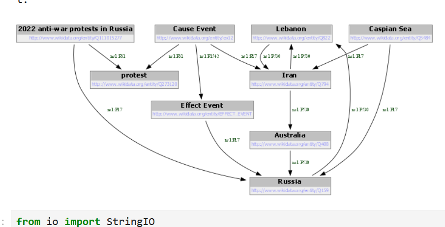
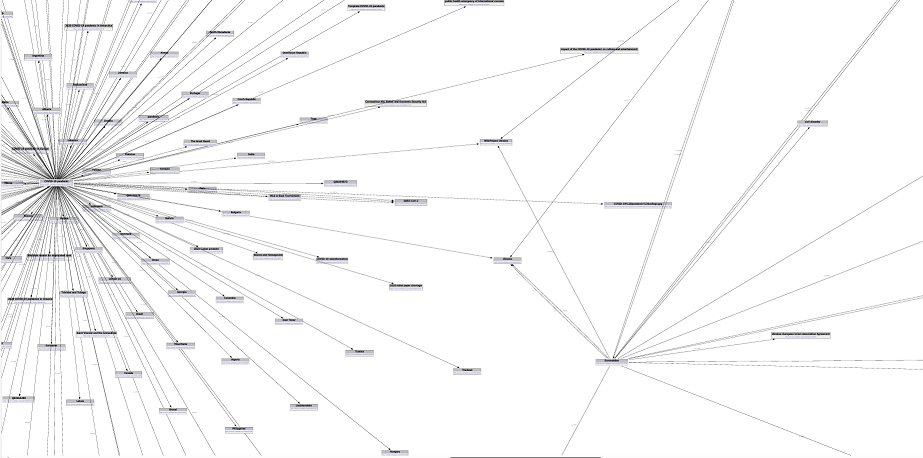

# Graphviz

Links: 
- Graphviz: https://graphviz.org/
- Pydotplus: https://pypi.org/project/pydotplus/

## Overview

Graphviz is a general purpose visualization tool for graphs, and makes use of the [DOT](https://graphviz.org/doc/info/lang.html)
language. On its own, DOT is not at all compatible with RDF, but there are some workaround available to convert your
RDF data into DOT format, which you can subsequently use to apply various other tools and layouts.

For this demo, we'll focus on a quick and dirty solution to getting your RDF data into DOT, and we won't focus much on
directly using DOT or any of its more advanced visualization features.

## Instructions

There are many options available for installing graphviz -- in this demo we'll also look at its use in python. 

You'll need to [download and install](https://graphviz.org/download/) graphviz first. 

Then you can `pip install graphviz` to make use of the python package to interface with it. You can find more info on 
the python package at https://pypi.org/project/graphviz/ 

Some simple examples of loading your KG and producing some output from graphviz is available in the
`rdf_to_graphviz.ipynb` notebook. 

The easiest way to get started is to make use of the `rdf2dot` tool from rdflib. This will give you an easy way to 
see an example of what the equivalent DOT format for a graph is. 

There are some shortcomings of `rdf2dot` -- namely, it seems to not be able to automatically fetch the property
names which I included in the graph. It also is pretty simple with its choice of visual style. 

From here, you would need to do some manual effort to do more customization of the rendering style, layout, or anything 
else. `rdf2dot` (for some reason) converts the content from an rdflib graph into a python Stream, but you can take a look
at the content using `stream.getvalue()`.

You can modify the layout by just editing the text of the DOT content, or by making your own parser. An example of just
editing the DOT string can be seen at the very end of the example notebook.

### Pros

- Quite powerful, lots of customization options
- Many existing tools to make use of dot format

### Cons

- Conversion from RDF to DOT is not very well documented or extensive; you will likely need to do some customization
- Graphviz itself is not particularly interactive; some other applications might exist, but you'll need to do a lot of
work to get to that point