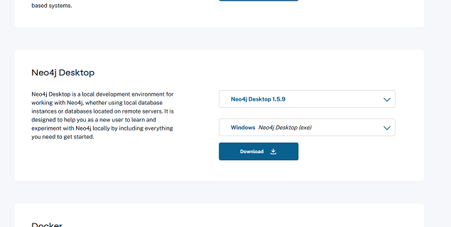
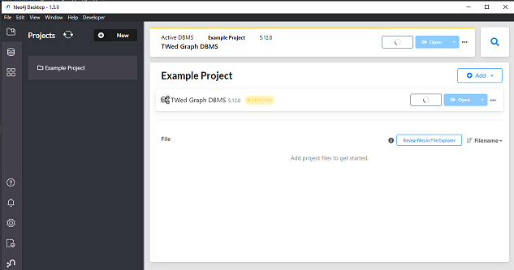
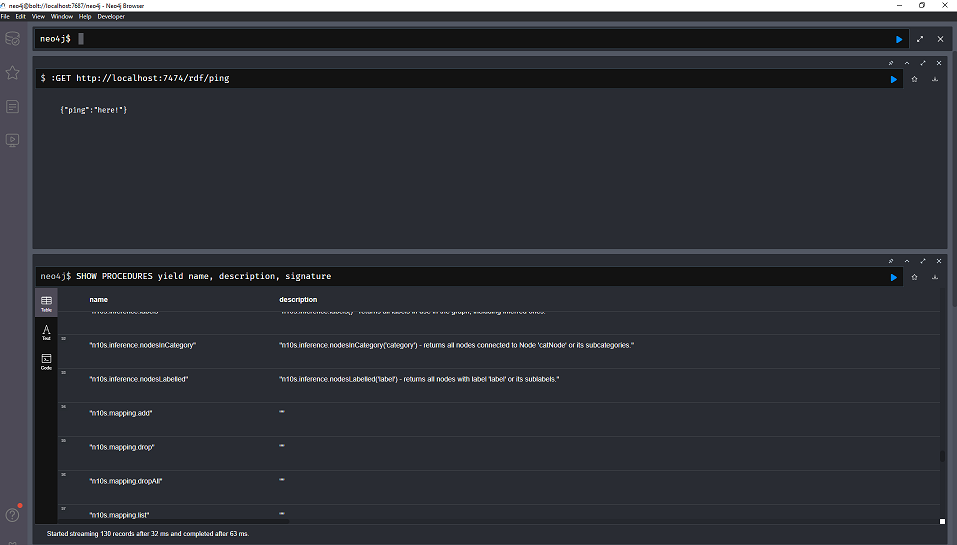
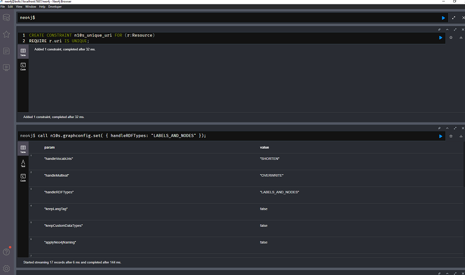
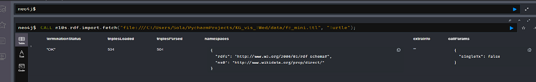
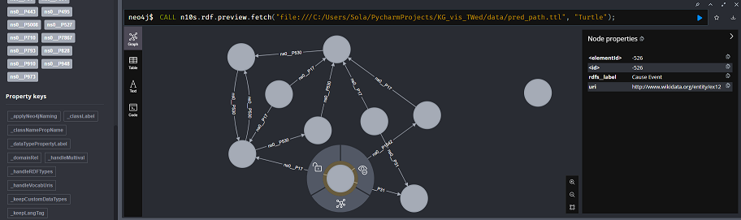

# Neo4j

Link: https://neo4j.com/

## Overview

Neo4j is a graph data storage and analytics platform. They offer many enterprise/cloud services, but they also offer
a local desktop version of their software which can be used for free.

Most of their links try to point you towards their paid and cloud services. There is a free tier for their cloud offering,
but you can also get their local development environment (which I use in this demo) from https://neo4j.com/deployment-center/#gdb-tab .

Neo4j does **NOT** use standard RDF or SPARQL -- instead, they use a custom format for their graph data, and querying
is performed using Cypher queries. This introduces an additional learning curve to perform queries, and potentially
introduces many problems when importing data. 

Documentation about Cypher queries can be found at https://neo4j.com/docs/cypher-manual/current/introduction/ .

Documentation about data importing can be found at  https://neo4j.com/docs/getting-started/data-import/ . 

Interestingly enough, support for RDF data is not particularly highlighted by Neo4j. Instead, you need to use an
additional plugin to perform the import to/from Neo4j's format. https://neo4j.com/labs/neosemantics/4.1/introduction/
Further details can be found in the instructions below.

## Instructions

Download the neo4j desktop environment. You will need to input some personal information and/or create an account to
do so. Installation is available for Windows, Mac, and Linux.





Create a local DBMS, then [install the neosemantics plugin](https://neo4j.com/labs/neosemantics/5.14/install/) into
its plugins folder. Note that you might have to be careful about version compatibility - for this demo I'm using a
Neo4j 5.17.0 instance with the neosemantics version 5.17.0. The default neo4j version may not be the most up-to-date
version.

If installation of the neosemantics plugin was successful, you should see something like the following through the
Neo4j Browser. Note that the documentation in neosemantics to run the `call dbms.procedures()` to verify installation
appears to be outdated. You should see `n10s...` commands if installation is successful.



Before importing, you also must [configure Neo4j to handle RDF data](https://neo4j.com/labs/neosemantics/5.14/config/).
This is done using `CALL n10s.graphconfig.init()`, as well as setting a uniqueness constraint on URIs. **IMPORTANT** as
of the time of writing (march 25 2024), the documentation in neosemantics appears to be somewhat out of date 
(although the error messages can guide you through to fix the syntax).
The correct way to set the constraint is as follows.

```
CREATE CONSTRAINT n10s_unique_uri FOR (r:Resource)
REQUIRE r.uri IS UNIQUE;
```



Now we can finally import RDF data, either from a local file or from a URL.



And visualize the graph contents.



...and this is as far as I'm willing to go for this demo. If you're starting from RDF data, I would not recommend
using Neo4j.

## Pros

- The formatting and spacing of graph contents looks kind of nice
- If you have some reason to want to work with Cypher queries, having an option to go to Neo4j is nice

## Cons

- There is extremely limited support for RDF, and a ton of workarounds are needed
- Without using `rdf:type`, the visualization is quite unappealing
- The plugin does not seem to handle `rdfs:label` appropriately
- OWL class restrictions get loaded in to the visualizations as a ton of bnodes
