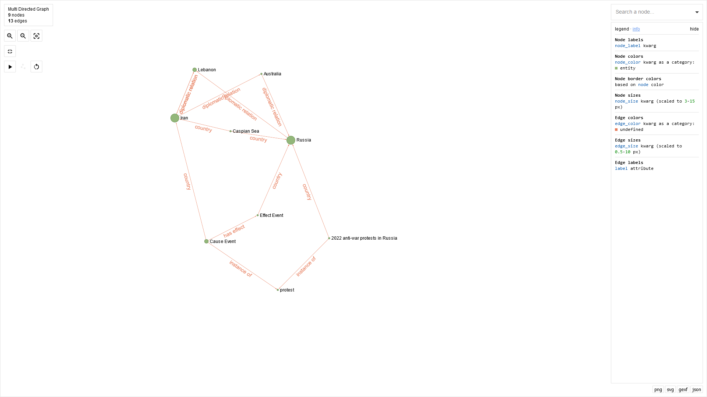
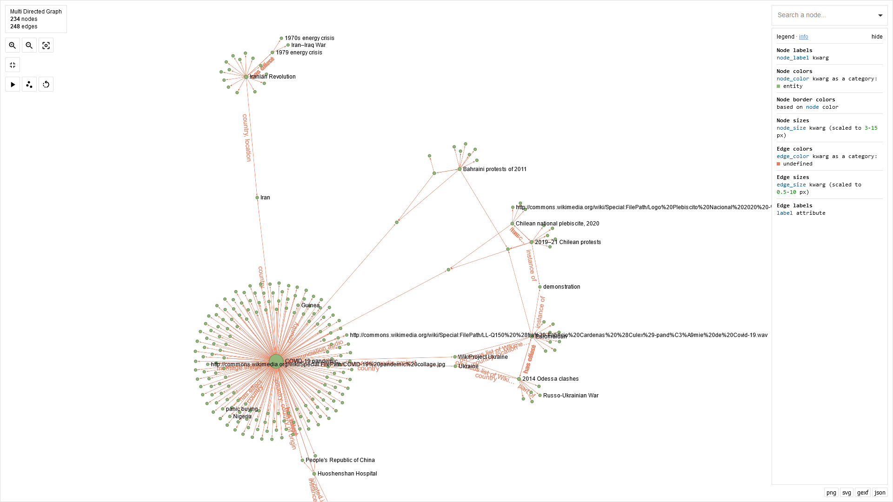
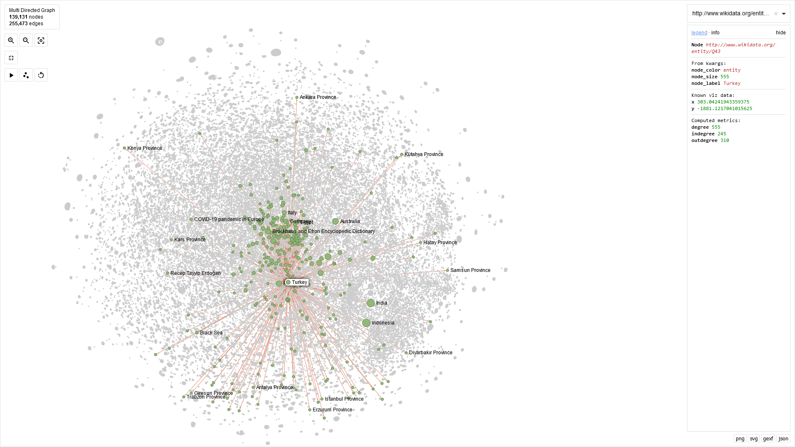

# sigma

Links: 
- sigma.js: https://www.sigmajs.org/
- ipysigma: https://github.com/medialab/ipysigma

## Overview

sigma.js is a javascript library for graph visualization, which can be used to make some nice looking graphs
and applications. 
There also is a convenient python module to support rendering sigma graphs within jupyter notebooks, which is somewhat
interactive -- in this demo we'll be focusing on using this for convenience. 

sigma is intended to work together with [graphology](https://graphology.github.io/), so we once again need to put some
effort into converting from RDF into a suitable format. 

For ipysigma, a convenient way to do this is to go from RDF graphs to [networkx](https://networkx.org/) MultiDiGraphs.

## Instructions

This demo will assume the use of networkx and ipysigma in a jupyter notebook.
`pip install networkx`
`pip install ipysigma`

The main methods that I'll discuss in this demo are to (1) convert your KG from a rdflib graph to a networkx graph, and
(2) set some simple options to display the graph via sigma.

An example and functions can be found in `rdf_to_networkx.ipynb`.

We essentially want to parse through all of the triples in the KG, make some decisions about how we want to handle
things like labels, and add each edge into networkx. 
In the example functions, we don't add literals (literals seem to cause issues for ipysigma), and we also manually make 
sure that we are including labels for edges. If no label is provided for a node, the URI will end up being the default.

The graph produced by ipysigma is somewhat interactive, and you can select nodes of interest to highlight them.
You can't actually move them around with drag-and-drop though -- this is something you'd need to set up as a custom
application using the actual javascript.

The visualization looks reasonable for larger graphs too.

We definitely start to see some strain for the largest KG (containing 140,000 nodes and 255,000 edges), but
we can still see *some* basic info in the interactive canvas.

rdflib has an existing `rdflib_to_networkx_multidigraph` function, but it doesn't do very well with handling how to
assign labels.

### Pros

- Easy to use as a "demo" in a notebook
- Relatively powerful
- Somewhat interactive and nice to browse through
- Relatively easy to customize certain aspects

### Cons

- Some effort required for customization and conversion to appropriate graph format
- Simple implementation in notebook doesn't support drag and drop or finer control over position
