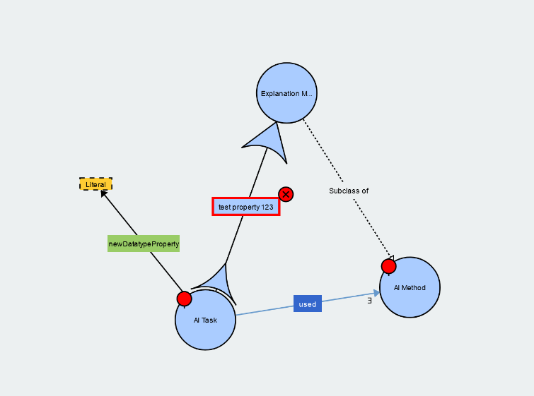

# WebVOWL

Link: https://github.com/VisualDataWeb/WebVOWL
Web App: https://service.tib.eu/webvowl/

## Overview

WebVOWL is a web application for visualizing ontologies. It seems to primarily be focused on classes and their 
relations, so it doesn't seem to be the best option for general triple visualization, but for a more narrow
use case it seems to do the job fairly well. 

There is a web app which you can directly access and upload data to, or you can download the code and run it yourself
locally. In this demo we'll look at what can be done on the web app.

## Instructions

Navigate to the web app and upload an ontology file.

In this example we show some of the Explanation Ontology which shows up when we upload it to WebVOWL.  

The instance-level data doesn't seem to get visualized very well (everything is just connected to `Thing`), but
some notable classes and relations between them are displayed.

You also are able to do some editing through the UI. However, this appears to not be terribly stable, since on one 
attempt to do editing I had the nodes start flying around and crash my browser.

### Pros

- Looks pretty
- Easy to load up an ontology and get some quick visuals

### Cons

- Only suitable for ontologies
- Editing is not extremely stable
- Some UI functions aren't particularly intuitive
- Imported ontologies also are visualized, which may or may not be helpful