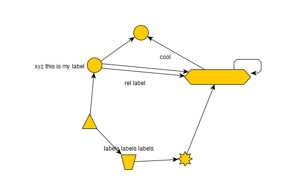
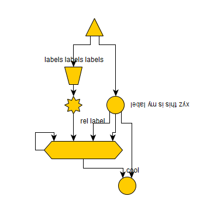
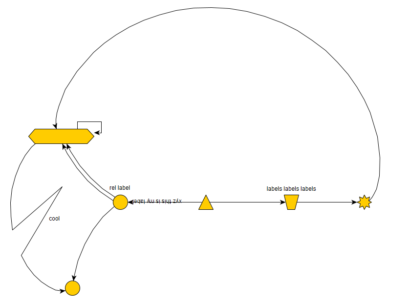

# yEd

Link: https://www.yworks.com/products/yed

## Overview

yEd is a diagram editing application, which has nice layout algorithms and can import various data formats. yWorks seems
to have other software that's more powerful and probably handles triple data better, but much of their offerings are
paid (free trials are available, but only last for 60 days).

## Instructions

Download and install yEd from https://www.yworks.com/products/yed/download#download . Installation is available for
Windows, Mac, and Linux.

yEd is able to do some importing of XML and graphml file formats, but it's definitely not intended to be used with
RDF triples. As a result this is mostly going to be another case where you will have to do a lot of manual
effort to make your graphics. However, once you get the basics in place, yEd does offer some nice options to
automatically adjust layout.

The `Layout` button will automatically adjust your graph as desired.

The UI will probably be a matter of preference between this or draw.io -- personally I think this one is pretty good.

### Pros

- Lots of control and options
- Automatic layouts are handy

### Cons

- Manual effort
- Learning curve